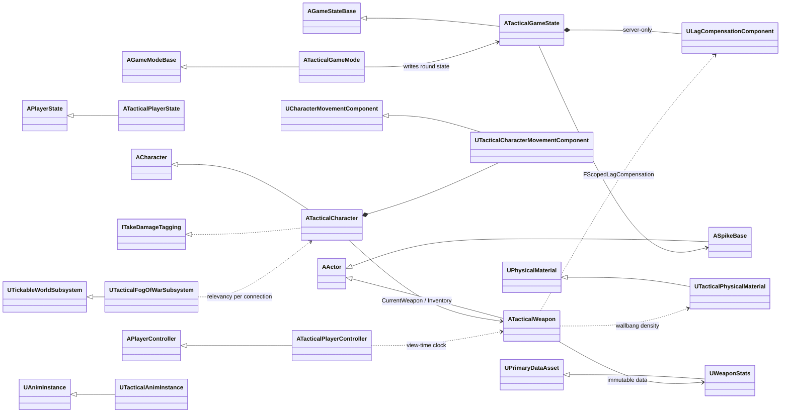
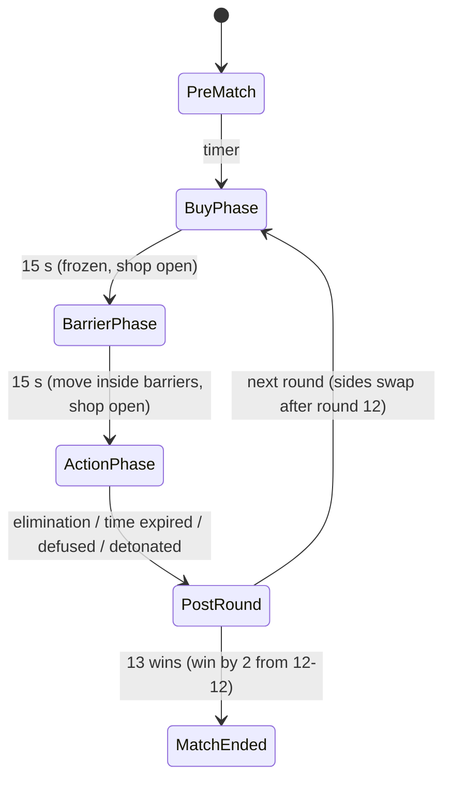

# TacticalDeployment: System Architecture

A 5v5, round-based tactical FPS with no abilities: gunplay, deterministic movement, and a spike (bomb) objective.
Target: **Unreal Engine 5.4+**, **authoritative dedicated server at 128 Hz** (7.8125 ms frame budget), **Iris** replication with push-model properties.

> Status: the C++ architecture and core implementation. All game rules (hit registration, rewind, wallbangs, spray, spread, fire-rate gate, fog-of-war decisions, movement tuning, tagging, spike, round flow) plus the presentation math (viewmodel springs, HUD) are compiled and exercised by a headless simulation harness, 53 scenarios, all passing (see [Verification](#10-verification-headless-simulation)). The UE-bound classes (actors, components, RPCs, Iris) have **not** been compiled against an engine install yet; a static checker covers their Unreal wiring. Blueprints, meshes, AnimBPs, input assets and maps still need to be authored. See [Integration checklist](#integration-checklist) and [Known gaps](#known-gaps).

---

## 1. Overview

### Trust model

| Actor | Trusted with | Never trusted with |
|---|---|---|
| **Client** | Its own movement *inputs* (predicted locally), aim (control rotation), button presses, the view time it rendered | Positions of others, bullet direction after recoil/spread, damage, fire cadence, ammo, round state, economy |
| **Server** | Everything | – |

The client sends *intent*. The server simulates, validates and decides.

### Class map



### Source layout

```
Config/DefaultEngine.ini                 128 Hz, Iris, push model, collision channels, anti-speedhack
Config/DefaultGame.ini                   round rules, fog-of-war tuning
Source/TacticalDeployment/
  Public/Core/TacticalTypes.h            enums, channels, 128 Hz constants, pitch quantization
  Public/Core/ClockSync.h                * NTP-style clock sync -> view-time stamps
  Public/Net/FogOfWarRules.h             * Pillar 1 - relevancy decision, lookahead, sample points, noise
  Public/Net/FogOfWarSubsystem.h         Pillar 1 - async LOS traces, Iris exclusion groups (+ settings)
  Public/Combat/HitboxRewind.h           * Pillar 2 - FFrameRecord, FFrameHistory ring buffer, ray-capsule, rewind time
  Public/Combat/LagCompensationComponent.h   Pillar 2 - recording from bones, FScopedLagCompensation
  Public/Weapons/WeaponStats.h           * Pillar 3 - UWeaponStats, spray state, spread/recoil math
  Public/Weapons/ShotRules.h             * Pillar 3 - bullet path solver (wallbangs), exit probe rule, fire-rate gate
  Public/Weapons/TacticalWeapon.h        Pillar 3 - fire RPC, validation, world/hitbox queries
  Public/Weapons/TacticalPhysicalMaterial.h  * Pillar 3 - density per material
  Public/Character/TacticalMovementTuning.h  * Pillar 4 - tuning constants, max-speed rule
  Public/Character/TacticalCharacterMovementComponent.h  Pillar 4 - snappy CMC, saved moves
  Public/Character/TakeDamageTagging.h   * Pillar 4 - ITakeDamageTagging, FTaggingState (curve + stacking)
  Public/Game/RoundRules.h               * Pillar 5 - sides, match point, elimination, phase gates, timer transitions
  Public/Game/SpikeRules.h               * Pillar 5 - plant/defuse timing, 50% checkpoint, defuse-vs-detonation race
  Public/Game/TacticalGameMode.h         Pillar 5 - state machine, economy, shop
  Public/Game/TacticalGameState.h        Pillar 5 - FTacticalRoundState, lag comp owner
  Public/Game/TacticalPlayerState.h      Pillar 5 - team, credits, K/D
  Public/Game/SpikeBase.h                Pillar 5 - spike, site volume, spawn barrier
  Public/Game/TacticalPlayerController.h clock sync (view time), shop RPCs
  Public/Character/TacticalCharacter.h   Pillar 6 - Mesh1P/Mesh3P, camera, relevancy, damage
  Public/Animation/TacticalAnimInstance.h  Pillar 6 - AimOffset inputs
  Public/Core/ViewmodelMotion.h          * exact critically damped springs: sway, bob, shot kick, landing dip
  Public/Core/HudMath.h                  * spread-to-pixels (honest crosshair), fades, clocks
  Public/Core/TacticalGameUserSettings.h player settings: sensitivity, crosshair, outline colour, low latency
  Public/UI/TacticalHUD.h                asset-free Canvas HUD
Config/DefaultScalability.ini            competitive scalability (quality never changes what you can see)
Tools/Simulation/                        headless harness: UE-core shim + 53 scenario tests
Tools/Lint/check_unreal_conventions.py   static checks for RPCs, replication and push-model wiring
```

`*` = engine-light rules: plain data and math on UE core types, called by the UE classes and compiled directly by the simulation harness.

### A shot, end to end

```mermaid
sequenceDiagram
    participant C as Client (autonomous)
    participant S as Server (128 Hz)
    participant O as Other clients
    C->>C: LocalFireShot(): predict spray index, cosmetic spread, view kick, tracer
    C->>S: FlushServerMoves() (velocity up to date)
    C->>S: Server_FireWeapon(ViewTime, Start, End, ShotIndex)
    S->>S: ServerValidateFire: alive, phase, ammo, equip, eye position; FFireCadenceGate on stamps
    S->>S: Spray.Recover(cadence time) -> recoil(index) + spread(server velocity, server-seeded RNG)
    S->>S: ResolveRewindTime(): client stamp vs. Now - RTT - interp, clamp 350 ms
    S->>S: FScopedLagCompensation: rewind enemy hitboxes (lerp between two FFrameRecords)
    S->>S: TraceWithPenetration(): world trace -> hitbox trace -> exit probe -> density cost
    S->>S: ApplyBulletDamage -> armor -> health -> ITakeDamageTagging
    S-->>C: Health / Tagging (owner-only, push model)
    S-->>O: FShotNotify (skip-owner, filtered by fog of war)
```

---

## 2. The 128-tick server budget (7.8125 ms)

Rough per-frame costs for 10 players on a mid-range server core. Use `stat Tactical` (all systems declare cycle stats in `STATGROUP_Tactical`) to replace these estimates with real numbers.

| Work | Frequency | Est. cost | Notes |
|---|---|---|---|
| CMC server moves (10 players) | every frame | 0.8-1.5 ms | Packed RPCs, move combining. |
| Mesh3P anim eval (10 skeletons) | every frame | 1.0-2.0 ms | Needed for exact hitboxes; URO disabled. Keep the server AnimBP minimal (locomotion + AimOffset only). |
| `ULagCompensationComponent::RecordFrame` | every frame | <0.05 ms | 10 x 16 bone reads, POD copy into a ring buffer, no allocations. |
| Fog of war dispatch | every frame (half the pairs) | ~0.05 ms game thread | 50 pairs x 5 async `Test` traces x 64 Hz = 16k traces/s, executed on task threads. |
| Iris poll + serialize | every frame | 0.5-1.0 ms | Push model: unchanged properties cost nothing. |
| Shot resolution | per shot | ~0.02-0.05 ms | Analytic capsule tests + 1-4 world traces. |

Headroom for GC and hitches is ~3 ms. Configure incremental GC (`gc.IncrementalBeginDestroyEnabled=1`, a small `gc.TimeBetweenPurgingPendingKillObjects`) and pre-load all content before the first round.

---

## 3. Pillar 1: High-tick netcode and network fog of war

### Engine config (`Config/DefaultEngine.ini`)

- **128 Hz:** `[/Script/OnlineSubsystemUtils.IpNetDriver] NetServerMaxTickRate=128` caps the dedicated server's frame rate (`UGameEngine::GetMaxTickRate`). `bUseFixedFrameRate` stays off: a fixed delta makes server time drift from wall time during hitches, which would corrupt lag-compensation timestamps.
- **Clients send moves at 128 Hz:** `ClientNetSendMoveDeltaTime=0.0078125`.
- **Iris:** `bUseIris = true` in every `.Target.cs` compiles it in. `net.Iris.UseIrisReplication=1` plus `IrisNetDriverConfigs` turn it on at runtime. `net.SubObjects.DefaultUseSubObjectReplicationList=1` is required by Iris.
- **Push model:** `bWithPushModel = true` plus `net.IsPushModelEnabled=1`. Every property we own is `bIsPushBased` and marked dirty explicitly.
- **Poll rates:** `+PollConfigs` polls characters and weapons at 128 Hz and the spike at 32 Hz. Characters have their spatial grid filter disabled because the fog of war replaces it.
- **Anti-speedhack:** `bMovementTimeDiscrepancyDetection/Resolution` in `[/Script/Engine.GameNetworkManager]`.
- **Channels:** `WeaponTrace` (hitscan vs. world; capsules and meshes ignore it), `FogOcclusion` (LOS vs. world), `SpawnBarrier` (object type that blocks only pawns).

### Fog of war (`UTacticalFogOfWarSubsystem`)

**Principle:** a wallhack can only draw what the client has. If an enemy is neither visible nor audible to you, your client does not have that actor at all.

Each server frame, half of the ordered (viewer, enemy) pairs are evaluated (`EvaluationStride=2`, so every pair runs at 64 Hz):

1. **Latency-aware positions** (`FogOfWarRules::ComputeRevealLookahead`). The server reveals an enemy slightly *before* they come into view, so it is already on the client when the corner clears. This avoids "peeker pop-in", which was the main complaint Riot documented for VALORANT's fog of war. Evaluation latency is `(EvaluationStride + 1)` frames: up to `Stride` frames waiting for the pair's turn, plus one frame for async results.
   - **Target** extrapolation = evaluation latency. The viewer renders the target from server snapshots, so the data only has to be sent by the frame the target becomes visible.
   - **Viewer** extrapolation = **full RTT** + evaluation latency. A peeking client predicts its own movement, so it is ahead of the server by the upstream leg, and the enemy data still has to travel the downstream leg. The first design used RTT/2 for both terms; the simulation showed that version revealing enemies late (pop-in) at 100 ms RTT and above.
   - Both are capped at `MaxRevealLookahead` (200 ms). Past about 177 ms RTT, a player's own peeks reveal slightly late. That is an accepted anti-ESP trade-off.
2. **Optimistic silhouette.** Five sample points: head, chest, both shoulders pushed out by `radius * SilhouetteExpansion`, and feet. The shoulders are the first thing to clear a corner.
3. **Async `Test` traces** on `FogOcclusion` with simple collision. This is the cheapest query type and runs off the game thread. Results arrive next frame through `FTraceDelegate`. `UserData` packs the pair index and a generation counter, so results for a recycled slot are discarded.
4. **Relevancy decision** (`ComputeRelevancy`):

   | Condition | Relevant? |
   |---|---|
   | Viewer is a caster (`Spectator` team) or a teammate | yes |
   | Target is dead | yes (a corpse carries no tactical information) |
   | Any sample visible within the last `VisibilityGraceTime` (250 ms) | yes (hysteresis prevents relevancy churn) |
   | Target made a noise (running footsteps, landing, gunfire) within `NoiseMemoryTime` and the viewer is inside that noise radius | yes (the client must spatialize the sound) |
   | Otherwise | **culled** |

   Shift-walking produces no noise, so a walking enemy behind a wall stays completely invisible to the network.
5. **Dead players** are evaluated through the teammate they spectate (`ResolveViewerCharacter`), so they can't pass information to their team.

**Two output paths, one decision:**

- **Legacy replication / ReplicationGraph:** `ATacticalCharacter::IsNetRelevantFor` asks `IsRelevantTo()`. Weapons use `bNetUseOwnerRelevancy`. The spike forwards to its carrier while carried. `RelevantTimeout=1.0` limits how long a culled channel lingers.
- **Iris:** Iris does not call `IsNetRelevantFor`. Each character gets an **exclusion group** containing the character, its weapons, and the spike while carried. The subsystem calls `SetGroupFilterStatus(Group, ConnectionId, Allow|Disallow)`, and only when a (connection, target) bit changes, so the steady-state cost is zero. All Iris calls are isolated at the bottom of `FogOfWarSubsystem.cpp` because group-creation signatures differ between engine minor versions.

**Trade-off:** culling destroys the actor on that client and re-reveal re-sends its initial state (~150-250 bytes). The grace window and lookahead keep this to a few events per engagement. To avoid spawn hitches on reveal, keep character assets resident; never async-load a skeletal mesh during a reveal.

---

## 4. Pillar 2: Lag compensation and server-side rewind

### Data (`LagCompensationComponent.h`)

```cpp
// Combat/HitboxRewind.h
struct FHitboxSnapshot      { FVector3f Center; FQuat4f Rotation;                  // 40 B, self-contained:
                              float Radius; float HalfSegment; EHitZone Zone; };   // shape + zone travel with it
struct FCharacterPoseRecord { FVector3f BoundsCenter; float BoundsRadius;
                              uint8 NumHitboxes; bool bValid;
                              FHitboxSnapshot Hitboxes[16]; };
struct FFrameRecord         { double ServerTime;
                              FCharacterPoseRecord Characters[12]; };               // one server frame
class  FFrameHistory;       // fixed-capacity ring buffer + binary-search FindBracket()
```

Snapshots carry their own shape and zone, so a rewound trace never consults the live character. That character may have died, respawned or changed mesh since the frame was recorded.

- **Hitboxes are separate from the movement capsule.** `FHitboxDefinition` (bone, zone, radius, half-segment, local offset/rotation) is authored on the character Blueprint. The capsule and meshes ignore `WeaponTrace`, so a bullet can only hit a hitbox.
- **Ring buffer:** `HistoryCapacity = 136` frames, which is 1000 ms at 128 Hz plus 8 frames of slack for hitches. It is allocated once in `BeginPlay`, and `RecordFrame` does no allocations. Memory is about 1 MB.
- **Recording** happens in `TG_PostUpdateWork`, after animation has produced final bone transforms. The dedicated server must actually evaluate the pose: `ATacticalCharacter::PostInitializeComponents` sets `AlwaysTickPoseAndRefreshBones` and disables URO on `Mesh3P`.

### How far to rewind

```
rewind = downstream leg (RTT/2)   the snapshot the client rendered was already this old
       + upstream leg   (RTT/2)   the fire RPC's trip back
       + proxy interpolation      Linear CMC smoothing, 2 server frames
```

"Rewind by RTT/2" is only one of the two legs. `ATacticalPlayerController` runs an NTP-style clock sync (min-RTT filter over 8 samples, slewed offset) and stamps every shot with `ViewTime = EstimatedServerNow - RTT/2 - interp`. `ULagCompensationComponent::ResolveRewindTime` accepts that stamp only if it agrees with the server's own `Now - RTT - interp` estimate within `ClientTimeTolerance`, and otherwise falls back to the estimate. The result is clamped to `MaxRewindTime = 350 ms`, a fairness cap: past it, high-ping players would kill people who had already reached cover.

### Rewind, trace, restore

```cpp
{
    FScopedLagCompensation Rewind(*LagComp, RewindTime, Shooter); // binary-search 2 frames, lerp/nlerp every enemy
    FRewoundHit Hit;
    Rewind.LineTrace(Start, End, Hit);                             // bounds sphere -> ray-vs-capsule per hitbox
}                                                                  // restore: nothing to undo
```

The live skeletal meshes and the physics scene are never moved. The rewound hitboxes are a scratch copy of analytic shapes, so "restore" costs nothing, nothing else in the frame can see a rewound state, and there is no physics-scene write or bone refresh. The ray-capsule test is exact: cylinder body plus hemispherical caps, with an inside-start case.

---

## 5. Pillar 3: Deterministic gunplay

### `UWeaponStats` (`UPrimaryDataAsset`, `Const`)

Damage (`BaseDamage`, `HeadMultiplier`, `ArmMultiplier`, `LegMultiplier`, stepped `RangeBrackets`), `WallPenetrationTier`, `FireRate` (rounds/s), handling, recoil, spread and tagging parameters. One immutable asset is shared by every instance on every machine. Only the asset reference replicates, once (`COND_InitialOnly`).

### Recoil: pattern, not randomness

- `RecoilPattern` is a `UCurveVector` keyed by **bullet index** in the current spray. X is horizontal pull (yaw) and Y is vertical climb (pitch). Values are absolute offsets, and key 0 is (0,0) so the first shot goes where the crosshair is. The data validator warns otherwise.
- `FWeaponSprayState` is a pure function of shot timestamps. Idle time beyond one fire interval first removes firing error, then (after `RecoilRecoveryDelay`) rewinds the pattern at `RecoilRecoveryRate` bullets/s. Tap-firing therefore stays on bullet 0, and bursts partially reset.
- **Recoil never touches `ControlRotation`.** The server applies it to the bullet direction relative to the aim the client sent. The camera shows `CameraKickFraction` of it as a visual-only offset (`ATacticalCharacter::CalcCamera`). Recoil control is the player pulling the mouse against a known pattern, and a no-recoil cheat has nothing to remove.

### Spread: conditional accuracy

`ComputeSpread = (BaseSpread + MovementPenalty(speed) + FiringError) * crouch`

- `MovementPenalty` is keyed on **measured horizontal velocity**, not on which keys are held: 0 below `AccurateSpeedFraction` (30% of run speed), rising to `WalkSpread` at shift-walk speed and `RunSpread` at full run, or `AirborneSpread` while falling. This is what makes counter-strafing work (see Pillar 4).
- `FiringError` grows per shot after `FiringErrorGraceShots`, capped, and recovers while idle. This separates tapping from spraying.
- **Server-seeded spread.** The server's `FRandomStream` seed is never sent to clients. A shared seed would let cheats pre-compute the cone and aim-compensate ("no-spread"). The client draws its own cosmetic spread for tracers. The authoritative impact point replicates to other clients via `FShotNotify`.
- The client calls `FlushServerMoves()` before `Server_FireWeapon`, so the server evaluates movement inaccuracy at the same velocity the client had. Without this, a legitimate counter-strafe shot could be judged against an older, faster move still sitting in the client's send buffer.

### Anti-cheat validation (`ServerValidateFire`)

Alive, holding this weapon, not planting or defusing, `ActionPhase`, not reloading, equip time elapsed, ammo left. **Eye position** must be within 48 cm of the server's `GetPawnViewLocation`.

**Fire rate** (`ShotRules::FFireCadenceGate`) is checked on client stamps, which are immune to network jitter bunching RPCs together. It uses GCRA, the generic cell rate algorithm. Each accepted shot pushes a theoretical arrival time one interval ahead, and a shot may be early by at most `min(50 ms, interval/2)`. That tolerance is needed because the client's looping fire timer can only fire on frame boundaries: at 144 FPS a 102.6 ms interval produces 97.2 ms gaps. The first design (a fixed "gap >= 95% of the interval" rule) would have rejected up to 632 of 2000 honest shots at 30 FPS in the simulation. Stamps can't be used to bank shots: anything older than the expected age (RTT + interpolation + 50 ms) is raised to that floor, and stamps from the future are rejected. Simulated cheats (2x fire rate, forged stamps, a 10-shot dump with back-dated stamps) never exceed the legitimate rate. **Spray recovery** is timed on the gate's cadence time, so forged gaps between stamps cannot buy recoil recovery.

### Wallbangs (`TraceWithPenetration`)

```
loop:
  world trace (WeaponTrace, complex, returns PhysMaterial) -> entry
  rewound-hitbox trace over [segment start, entry]         -> body hit? apply damage, stop
  exit = LineTraceComponent(entry + dir*MaxThickness -> entry) on the same component
         (tracing backwards finds the far face; ShotRules::IsValidExitProbe rejects a probe that
          started inside the solid, which simple collision reports as a start-penetrating hit,
          or that re-hit the entry face: the wall is thicker than this tier can probe)
  cost = thickness_cm * UTacticalPhysicalMaterial::PenetrationDensity
  cost >= remaining power -> stop;  else power -= cost, damage *= 1 - cost/tier power
```

| Tier | Power (density-cm) | Max thickness | Max surfaces |
|---|---|---|---|
| Low | 12 | 20 cm | 1 |
| Medium | 25 | 40 cm | 2 |
| High | 50 | 80 cm | 3 |

Reference densities: glass 0.1, drywall 0.4, wood 0.6, concrete 2.0, sheet metal 3.0. `bImpenetrable` is for map boundaries. Final damage is `Base * zone * range bracket * penetration scale`. The loop itself is `ShotRules::SolveBulletPath`. The weapon supplies the world and rewound-hitbox queries, and the simulation supplies virtual ones.

---

## 6. Pillar 4: Movement and tagging

### Why a customized CMC rather than Mover (for now)

In UE 5.4 the Mover plugin is experimental, and its rollback path (Network Prediction plugin) has no production track record at 128 Hz with 10 players. The CMC's prediction and reconciliation is proven, and everything competitive can be layered on it deterministically. The design is ready to move to Mover (see below).

### Snappy ground model (`UTacticalCharacterMovementComponent`)

| Setting | Value | Effect |
|---|---|---|
| `MaxWalkSpeed` (run) | 675 cm/s | |
| `MaxShiftWalkSpeed` | 405 cm/s | Silent: no fog-of-war noise. |
| `MaxAcceleration` | 5200 | 95% of run speed in 125 ms (measured). |
| `GroundFriction` | 12 | With input opposing velocity, CalcVelocity bends velocity toward the input: about 19% of speed removed per 128 Hz tick. |
| `BrakingDecelerationWalking` + `BrakingFriction` | 3400 / 4 | Releasing a key stops you in 148 ms (measured). |
| `BrakingSubStepTime` | 1/75 | The finest the engine allows (it clamps to [1/75, 1/20]). |
| `MaxSimulationTimeStep` | 1/128 | Caps sub-steps. From 30 to 360 FPS, the counter-strafe slide varies by 3 cm and time-to-accurate by 4 ms (frame quantization). The server replays each client's exact steps, so this never causes corrections. |

Measured with a model of the engine's `PhysWalking`/`CalcVelocity`/`ApplyVelocityBraking` at 128 Hz, using these exact constants from `TacticalMovementTuning.h`:

| From full run | Accurate (<= 30% speed) | Stopped | Slide |
|---|---|---|---|
| **Counter-strafe** (opposite key) | 31 ms | 55 ms | 11 cm |
| **Release** key | 94 ms | 148 ms | 41 cm |

That 3x gap is the skill.

**Predicted intents:** shift-walk (`FLAG_Custom_0`) and the plant/defuse movement lock (`FLAG_Custom_1`) ride in `FSavedMove_Tactical`'s compressed flags. The server applies them on exactly the same moves the client predicted them on, so they cause no corrections. The phase freeze (`PreMatch`, `BuyPhase`) is read from replicated `FTacticalRoundState` on both sides, at the cost of at most one correction per phase change.

### Tagging (`ITakeDamageTagging`)

- `ATacticalCharacter::ApplyBulletDamage` calls `ITakeDamageTagging::ApplyDamageTag({SlowFraction = weapon.TaggingSlow (0.7), Duration = 0.5 s})`.
- `FTaggingState` is expressed on the victim's **move clock**. The server stamps it with the client timestamp of the last move it processed (`ServerData->CurrentClientTimeStamp`). `GetMaxSpeed()` evaluates it at each move's own timestamp: `MoveAutonomous` supplies that timestamp for server processing and client replays, and `ClientData->CurrentTimeStamp` supplies it for new client moves.
- The curve is `scalar = 1 - Slow * (1 - SmoothStep(0, Duration, elapsed))`: it holds near full slow on impact and eases back to 1.
- The slow is quantized to 8 bits **before** the server uses it, so both sides evaluate identical numbers.
- **Result:** a tag causes exactly one correction, for moves already in flight when it landed. The replay after that correction reproduces the server bit-for-bit. Evaluating the tag on wall-clock time instead would mismatch every move during the ease-out.
- Stacking keeps the strongest remaining slow, and a new hit restarts the ease.

### Mover 2.0 migration outline

| CMC piece | Mover equivalent |
|---|---|
| `FSavedMove_Tactical` flags | `FTacticalMoverInputs : FMoverDataStructBase` (move intent, bWantsShiftWalk, bWantsInteractLock) produced in `ProduceInput` |
| Ground friction / braking | `UTacticalWalkingMode : UWalkingMode` overriding `OnGenerateMove` with the same friction model |
| `FTaggingState` | `FTaggingMovementModifier : FMovementModifierBase` (queued by the server, rolled back and re-simulated by Mover) |
| Phase freeze | A `UMovementMode` transition or a modifier that zeroes max speed |
| Fixed 1/128 sub-step | Network Prediction fixed-tick mode at 128 Hz |

---

## 7. Pillar 5: Round state machine and spike



- **`ATacticalGameMode`** (server only): a single `PhaseTimer` drives every transition. Round-ending events short-circuit into `EndRound()`, which is guarded so it runs once per round. Planting replaces the round timer with the 45 s fuse, so "time expired" can only mean the defenders held. Attackers eliminated **after** planting do not lose: the defenders still have to defuse.
- **`ATacticalGameState`:** a single push-model `FTacticalRoundState` (phase, `PhaseEndServerTime`, round, attacking team, planted flag, scores, last result). A phase change is one atomic replicated change and one `OnRep`. Countdowns are computed locally from the end time, so there is no per-second replication.
- **`ATacticalPlayerState`:** team, K/D, and **owner-only** credits, so enemies never see your economy.
- **Shop:** `Server_PurchaseWeapon(const UWeaponStats*)` is validated against the server's `ShopCatalog`, the phase, alive state and credits.
- **Spawn barriers:** `ATacticalSpawnBarrier` is **not replicated**. Server and clients toggle collision from the replicated phase, so predicted movement agrees on both sides.

### `ASpikeBase`

- **Plant:** 4 s. Carrier only, inside an `ASpikeSiteVolume`, `ActionPhase`, grounded.
- **Defuse:** 7 s. Defenders only, within range, one defuser at a time.
- **Interactions are timestamps:** `FSpikeInteractionState{Type, Interactor, StartServerTime, Duration, StartProgress}`. Clients render the progress bar locally, and replication happens only on start and stop.
- **50% defuse checkpoint:**
  ```cpp
  // on release OR death of the defuser
  if (Interaction.GetProgress(Now) >= 0.5f) DefuseCheckpoint = 0.5f;
  // on the next defuse (by anyone)
  Interaction.StartProgress = DefuseCheckpoint;              // 0.5
  Interaction.Duration      = 7.f * (1.f - DefuseCheckpoint); // 3.5 s
  ```
- **Defuse vs. detonation** is decided by comparing exact completion **timestamps**, not by which check happens to run first in a frame.
- **Anti-cheat:** the interaction is cancelled if the interactor drifts more than 8 cm from where they started. A client that suppresses its own movement lock gains nothing.
- **Relevancy:** while carried, the spike shares its carrier's fog-of-war visibility (legacy `IsNetRelevantFor` forwards to the carrier; Iris puts it in the carrier's exclusion group). Dropped or planted, it is relevant to everyone.

---

## 8. Pillar 6: Decoupled camera and viewmodel

| Component | Attached to | Visibility | Notes |
|---|---|---|---|
| `FirstPersonCamera` | **Capsule** at `BaseEyeHeight`, `bUsePawnControlRotation` | owner | Not a head bone: animation bob would make the eye non-deterministic relative to the server's hitscan origin. |
| `Mesh1P` (arms) + `WeaponMesh1P` | Camera | `bOnlyOwnerSee`, no shadows | Only ticks when rendered, so it costs the server and other clients nothing. |
| `Mesh3P` (`ACharacter::Mesh`) + `WeaponMesh3P` | Capsule | `bOwnerNoSee`, `bCastHiddenShadow` | Drives server hitboxes and what everyone else sees. |

**Anti-clipping:** `Mesh1P` is scaled to 0.5 and pulled in toward the camera, which gives the same screen footprint while physically staying inside the capsule, so it can't poke through walls. `NearClipPlane=2.0`. On engines that ship First Person Rendering, the constructor also enables `FirstPersonPrimitiveType`, `bEnableFirstPersonFieldOfView` and `bEnableFirstPersonScale` (guarded by `UE_VERSION_OLDER_THAN(5, 6, 0)`).

### Syncing 3P aim with the 1P camera

1. **Yaw:** `bUseControllerRotationYaw = true`, so actor yaw is aim yaw. `FRepMovement::RotationQuantizationLevel = ShortComponents` gives 16-bit yaw. The engine default is 8-bit (1.4 degrees), which is too coarse for head hitboxes.
2. **Pitch:** the server writes `ReplicatedAimPitch` (`uint16`, `COND_SkipOwner`, push-model, dirty only on change) from the controller rotation. `GetBaseAimRotation()` returns full precision on the owner and server, and the 16-bit value on simulated proxies. That is 0.003 degrees of precision versus the engine's 8-bit `RemoteViewPitch`.
3. **`UTacticalAnimInstance`** copies `GetBaseAimRotation()` on the game thread and computes `AimPitch`/`AimYaw` in `NativeThreadSafeUpdateAnimation`.
4. **3P AnimBP:** locomotion, then a **mesh-space additive AimOffset** (blend space, pitch -90..90) distributed over `spine_01..spine_03` and `neck_01`. A procedural alternative is `Transform (Modify) Bone` per spine bone using `SpinePitchPerBone`.
5. **Integrity rule:** the same AnimBP runs on the dedicated server, so the head hitbox the server rewinds is posed exactly as every client renders it. Do not add client-only smoothing to `AimPitch` on the 3P mesh.

---

## 9. Bandwidth notes

- Everything we own is **push-model**. A standing, silent player costs almost nothing beyond `FRepMovement`.
- Owner-only: health, armor, ammo, inventory, tagging, credits. Enemies never receive them.
- Round state: one struct and one `OnRep` per transition, with countdowns derived locally.
- Shots: a `FShotNotify` property (`COND_SkipOwner`), not a multicast. It coalesces under sustained fire and is filtered by the fog of war automatically.
- Aim: 2 bytes of pitch when it changes, and 16-bit rotation in `FRepMovement` (+3 bytes).
- Fog of war: culled enemies cost **zero** bytes to that connection.

---

## 10. Verification (headless simulation)

No Unreal Engine install is available where this was built, so verification has two parts.

**`Tools/Simulation`** compiles the project's real engine-light headers and `WeaponStats.cpp` against a thin stand-in for UE core types (`Shim/CoreMinimal.h`: vectors, rotators, quaternions, `FMath`, `FRandomStream`, `TArray`, reflection macros stubbed out). It then runs scenario tests in a virtual world: box geometry with UE-like trace semantics, a 13-piece hitbox rig, a latency and jitter network model, and a model of the CMC's walking physics.

```
cmake -S Tools/Simulation -B Tools/Simulation/Build -DCMAKE_BUILD_TYPE=Release
cmake --build Tools/Simulation/Build -j
Tools/Simulation/Build/TacticalSimulation            # or: ctest --test-dir Tools/Simulation/Build
python3 Tools/Lint/check_unreal_conventions.py
```

| Pillar | Scenario | Result |
|---|---|---|
| 1 | Enemy strafes out from a corner, RTT 20-150 ms | Revealed 31 ms before first visible frame |
| 1 | Viewer peeks a corner, RTT 20-150 ms | Revealed 37-50 ms beyond the required full RTT |
| 1 | Shift-walking enemy behind a wall for 5 s | Replicated on 0 of 640 frames |
| 1 | Running enemy at 27 m / 29 m | Replicated (audible) / culled |
| 2 | Strafing (A-D) target, headshots at displayed head, RTT 20-200 ms incl. asymmetric paths | 100% registered (RTT/2-only rewind: 7-39%, no rewind: 5-28%) |
| 2 | Proxy smoothing off by +/-8 ms from the assumed 15.6 ms | 100% registered; +16 ms: 72% |
| 2 | Clock sync, 20-75 ms legs, asymmetric 30/50 ms | View-time error <= 2.3 ms |
| 3 | Client vs server spray index over 40 random bursts with 40 ms jitter | 0 mismatches (arrival-time timing: 152) |
| 3 | Wallbangs: drywall, concrete, two walls, thick glass, boundary, range | Budget, surface count and damage scale exact |
| 3 | Honest auto-fire at 30-360 FPS +/-25% frame jitter, 2000 shots each | 0 rejected |
| 3 | 2x rate / forged stamps / back-dated 10-shot dump | <= legit rate / 2 accepted / 1 accepted |
| 4 | Counter-strafe vs release | 31 ms vs 94 ms to accurate |
| 4 | Tag on the move clock, 80 ms RTT | 6 in-flight moves corrected once, 0 mismatches after replay (wall-clock: 62) |
| 5 | Defuse released at 3.499 s / 3.5 s | 0% / 50% banked; resume needs 3.5 s |
| 5 | Defuse completing 1 ms before detonation, evaluated 5 ms late | Defused |
| 5 | 1000 virtual matches (22k rounds): eliminations, time-outs, plants, partial and full defuses, overtime | All scores legal (13-x or overtime win by 2), 0 rule violations |
| 6 | 16-bit aim pitch | 0.0014 deg max error = 0.015 mm at the head (8-bit engine default: 7.4 mm) |

**Mutation checks.** Six deliberate defects were injected one at a time into the real game code, and each one failed the suite: checkpoint banking raw progress, capsule caps ignored, RTT/2 viewer lookahead, the old exit-probe rule, the cadence gate without burst tolerance, and rewinding only RTT/2. Four injected wiring defects were each caught by the checker: a missing dirty mark, a missing RPC implementation, an unregistered property, and an OnRep that isn't a UFUNCTION.

**Defects the simulation found and this revision fixes:**
1. *Wallbang through over-thick walls.* With simple collision, the backward exit probe starting inside a solid returns a start-penetrating hit at the probe point, and that was accepted as the exit. Fixed by `ShotRules::IsValidExitProbe`.
2. *Honest shots rejected at common frame rates.* The fire-rate check ignored frame quantization of the fire timer and let clients bank up to 1 s of shots. Fixed by `FFireCadenceGate`.
3. *Forged stamp gaps bought recoil recovery.* Fixed by timing the server spray on the gate's cadence time.
4. *Late reveals on your own peeks at 100+ ms RTT.* The viewer lookahead used RTT/2. Fixed by using the full RTT.
5. *Rewound traces read the live character's hitbox definitions*, which were wrong if the mesh or definitions changed after recording. Fixed by making snapshots self-contained.
6. *`FMath::ClampAngle` called with mixed float/double arguments*, which UE's template may reject. Fixed.
7. Doc numbers (counter-strafe 45 ms / release 200 ms) replaced with measured values.

**What this does not verify:** that the UE-bound classes compile against a real engine (Iris API names and `UE_VERSION` guards in particular), real animation-driven hitboxes, the actual smoothing delay of CMC Linear smoothing (calibrate `ProxyInterpolationDelay` in-engine, since the margin is about +/-10 ms), and performance under the 7.8125 ms budget.

## 11. Presentation, graphics and client performance

Everything here is cosmetic or client-side. None of it changes aim, hit registration or what the server replicates.

### Viewmodel motion (`Core/ViewmodelMotion.h`, driven by `ATacticalCharacter::UpdateViewmodel`)

`Mesh1P` is moved by six exact critically damped springs:
- **Sway:** lags fast mouse movement, capped at 3.5 degrees.
- **Bob:** a stride-synced figure-eight that scales with speed and is zero in the air.
- **Shot kick:** a backward shove plus muzzle climb, scaled by `UWeaponStats::ViewmodelKick`.
- **Landing dip:** scales with impact speed.

The springs integrate the closed-form solution rather than Euler steps. The simulation shows the same state to within 0.01% from 30 to 360 FPS, and stability through 2-second hitches. A shot kick peaks at 2.1 cm and settles in 242 ms with no overshoot. The camera never moves: sway on the camera would move the crosshair away from where bullets go.

### HUD (`UI/TacticalHUD.h`), drawn entirely with Canvas

The game is playable with zero UI assets:
- **Honest crosshair.** The line gap opens by exactly the screen radius of the current spread cone (`HudMath::SpreadToPixels`, checked against a pinhole projection). At 103 degrees FOV and 1920 px that is 1.3 px standing still, 21 px walking and 68 px running. Counter-strafe accuracy is therefore visible. The crosshair's colour, size, gap, outline, dot and dynamic spread are all player settings.
- **Hit markers:** white for body, gold for head, red for a kill, dimmed for a wallbang. They come from `ATacticalPlayerController::Client_HitConfirmed`, an unreliable RPC sent to the shooter only.
- **Round state:** scores (your team always on the left, in ally colour), the phase clock, attack/defend, and round won/lost. The clock is hidden after a plant, so the spike is timed by ear.
- **Vitals:** health, armor, and ammo (turns red at 25% or less). Credits show only while the shop is open.
- **Spike bar:** plant/defuse progress, with the 50% defuse checkpoint drawn as a tick that turns gold once banked.
- **Kill feed:** `ATacticalGameState::Multicast_KillFeed`, unreliable, with headshot and wallbang tags. It contains no positions, so it can't leak what the fog of war hides.
- **Net stats:** FPS and ping.

### Visibility

**Enemy outline.** On clients, `Mesh3P` renders custom depth with stencil 1 for enemies and 2 for allies (`r.CustomDepth=3`). Players choose the colour: red, or yellow and purple for colour-blind players. The HUD writes it into a Material Parameter Collection. **Artist step:** create an MPC with a vector parameter `EnemyHighlightColor`, and a post-process material that samples CustomStencil. Where stencil == 1, compare 4 neighbouring CustomDepth samples against the pixel's own; where they differ (silhouette edge), lerp SceneColor toward the MPC colour. Assign the MPC to `ATacticalHUD::HighlightParameters` and the material to a global post-process volume.

**Rendering profile** (`DefaultEngine.ini`):
- No motion blur, bloom or lens flare.
- **Fixed exposure**, so a doorway is equally bright to both players with no eye-adaptation flash when peeking.
- FXAA, because temporal AA leaves ghost trails behind strafing enemies.
- Baked GI with SSR and CSM rather than Lumen/VSM, to hold 144-360 FPS on mid-range PCs.
- Nanite for static geometry, and a GPU skin cache for characters.

**Scalability** (`DefaultScalability.ini`) follows one rule: quality may change how pretty things are, never what you can see. View distance, skeletal LOD and dynamic character shadows are identical on every level, so Low is not an advantage.

**Latency.** VSync is off by default and the frame rate uncapped. Low-latency mode sets `r.GTSyncType=1` (game thread waits for the RHI thread) and `r.OneFrameThreadLag=0`.

### Physics and server CPU

- **No physics state on character meshes while alive.** Hit registration uses analytic hitboxes, so the dedicated server's `Mesh3P` has no collision, `bEnablePhysicsOnDedicatedServer = false` and `KinematicBonesUpdateType = SkipAllBones`. There are also no animation-driven overlap updates. This removes a kinematic body sync for 10 skeletons every 7.8 ms frame.
- **Directional death.** Ragdolls (client-only) inherit the character's velocity and get an impulse along the killing shot, at the head or chest bone depending on where it hit. That uses `FDeathInfo`, which replicates with `bIsDead`. Spike deaths are thrown away from the spike.

## Integration checklist

1. Create `BP_TacticalCharacter` from `ATacticalCharacter`. Assign meshes (arms and body), the AnimBPs (both parented to `UTacticalAnimInstance`), the Enhanced Input assets, and the **hitbox list** (head sphere, neck, 3 spine capsules, pelvis, upper/lower arms, thighs, calves). Add a `spike_socket` to the body skeleton.
2. Create weapon Blueprints from `ATacticalWeapon` (meshes, `GripPoint`/`weapon_r` sockets, `PlayFireEffects`) and one `UWeaponStats` asset per gun with its `RecoilPattern` curve.
3. Create `UTacticalPhysicalMaterial` assets and assign them to map materials.
4. Map: place `APlayerStart`s tagged `Attackers`/`Defenders`, `ASpikeSiteVolume`s, and `ATacticalSpawnBarrier`s.
5. `BP_TacticalGameMode`: set `DefaultPawnClass`, `SpikeClass`, `DefaultSidearm` and `ShopCatalog`.
6. Register `WeaponStats` as a Primary Asset Type in Asset Manager settings.
7. Build the `TacticalDeploymentServer` target and verify with `stat Tactical`, `stat net`, and `net.Iris.*` debug cvars under emulated latency (`NetEmulation.PktLag=60`, `PktLagVariance=10`, `PktLoss=1`).
8. Calibrate `TacticalNet::ProxyInterpolationDelay` against measured proxy display lag. The simulation shows about +/-10 ms of margin before headshots on strafing targets start to miss.
9. Keep `Tools/Simulation` and `Tools/Lint` green on every change (both run in seconds).
10. Create the enemy-outline MPC and post-process material (section 11) and assign them to `ATacticalHUD`.
11. Author lighting for fixed exposure (set the post-process volume's exposure compensation per map), and bake lighting.

## Known gaps

- The UE-bound classes have not been compiled against an engine yet (the rules they call are compiled and tested). The Iris exclusion-group calls, `UNetConnection::GetConnectionId` and the `UE_VERSION` guards are the most likely points to need small adjustments per engine minor version.
- Survivors do not keep their loadout between rounds, and there is no weapon drop or pickup (only the spike drops).
- No overtime side alternation, no pistol-round economy rules, no minimap data channel.
- In-engine automation tests (`IMPLEMENT_SIMPLE_AUTOMATION_TEST` / Gauntlet) are not written yet. The simulation scenarios port directly, because they call the same rule functions.
- Presentation is code-only: no meshes, textures, materials, sounds or VFX are included. The HUD uses the engine's default fonts. Weapon world models are not outlined yet (only `Mesh3P`).
- A hitch longer than one fire interval makes UE's looping timer fire twice in one frame. The server gate accepts only one of those shots, so client-predicted ammo can briefly read one low until the next ammo update.
