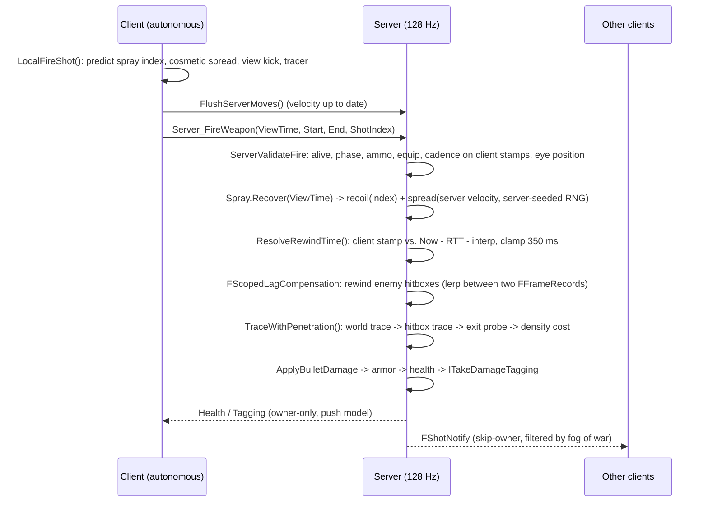
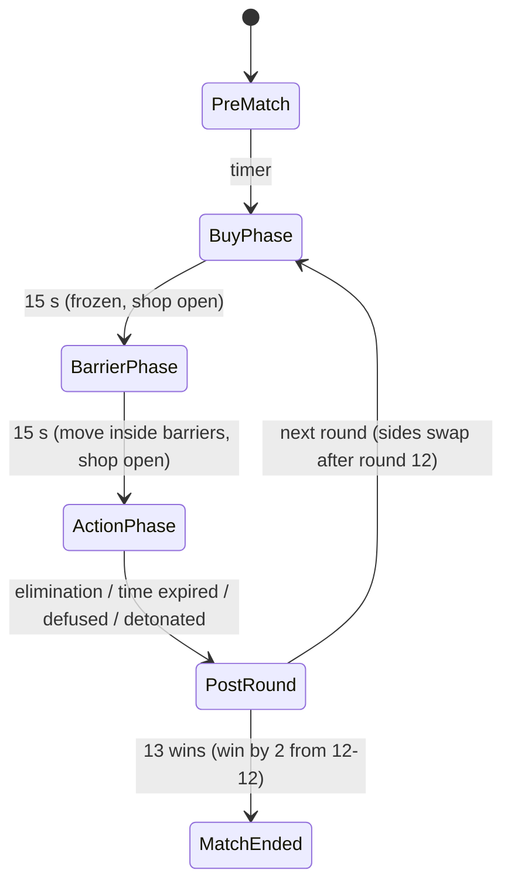

# TacticalDeployment: System Architecture

A 5v5, round-based tactical FPS with no abilities: gunplay, deterministic movement, and a spike (bomb) objective.
Target: **Unreal Engine 5.4+**, **authoritative dedicated server at 128 Hz** (7.8125 ms frame budget), **Iris** replication with push-model properties.

> Status: this is the C++ architecture and core implementation. It has not been compiled or run yet in this repository (no engine or content is checked in). Blueprints, meshes, AnimBPs, input assets and maps still need to be authored against these classes. See [Integration checklist](#integration-checklist) and [Known gaps](#known-gaps).

---

## 1. Overview

### Trust model

| Actor | Trusted with | Never trusted with |
|---|---|---|
| **Client** | Its own movement *inputs* (predicted locally), aim (control rotation), button presses, the view time it rendered | Positions of others, bullet direction after recoil/spread, damage, fire cadence, ammo, round state, economy |
| **Server** | Everything | – |

The client sends *intent*. The server simulates, validates and decides.

### Class map


### Source layout

```
Config/DefaultEngine.ini                 128 Hz, Iris, push model, collision channels, anti-speedhack
Config/DefaultGame.ini                   round rules, fog-of-war tuning
Source/TacticalDeployment/
  Public/Core/TacticalTypes.h            enums, channels, 128 Hz constants, pitch quantization
  Public/Net/FogOfWarSubsystem.h         Pillar 1 - network fog of war (+ settings)
  Public/Combat/LagCompensationComponent.h   Pillar 2 - FFrameRecord, ring buffer, FScopedLagCompensation
  Public/Weapons/WeaponStats.h           Pillar 3 - UWeaponStats, spray state, spread/recoil math
  Public/Weapons/TacticalWeapon.h        Pillar 3 - fire RPC, validation, penetration solver
  Public/Weapons/TacticalPhysicalMaterial.h  Pillar 3 - density per material
  Public/Character/TacticalCharacterMovementComponent.h  Pillar 4 - snappy CMC, saved moves
  Public/Character/TakeDamageTagging.h   Pillar 4 - ITakeDamageTagging, FTaggingState
  Public/Game/TacticalGameMode.h         Pillar 5 - state machine, economy, shop
  Public/Game/TacticalGameState.h        Pillar 5 - FTacticalRoundState, lag comp owner
  Public/Game/TacticalPlayerState.h      Pillar 5 - team, credits, K/D
  Public/Game/SpikeBase.h                Pillar 5 - spike, site volume, spawn barrier
  Public/Game/TacticalPlayerController.h clock sync (view time), shop RPCs
  Public/Character/TacticalCharacter.h   Pillar 6 - Mesh1P/Mesh3P, camera, relevancy, damage
  Public/Animation/TacticalAnimInstance.h  Pillar 6 - AimOffset inputs
```

### A shot, end to end



---

## 2. The 128-tick server budget (7.8125 ms)

Rough per-frame costs for 10 players on a mid-range server core. Use `stat Tactical` (all systems declare cycle stats in `STATGROUP_Tactical`) to replace these estimates with real numbers.

| Work | Frequency | Est. cost | Notes |
|---|---|---|---|
| CMC server moves (10 players) | every frame | 0.8-1.5 ms | Packed RPCs, move combining. |
| Mesh3P anim eval (10 skeletons) | every frame | 1.0-2.0 ms | Needed for exact hitboxes; URO disabled. Keep the server AnimBP minimal (locomotion + AimOffset only). |
| `ULagCompensationComponent::RecordFrame` | every frame | <0.05 ms | 10 x 16 bone reads, POD copy into a ring buffer, no allocations. |
| Fog of war dispatch | every frame (half the pairs) | ~0.05 ms game thread | 50 pairs x 5 async `Test` traces x 64 Hz = 16k traces/s, executed on task threads. |
| Iris poll + serialize | every frame | 0.5-1.0 ms | Push model: unchanged properties cost nothing. |
| Shot resolution | per shot | ~0.02-0.05 ms | Analytic capsule tests + 1-4 world traces. |

Headroom for GC and hitches is ~3 ms. Configure incremental GC (`gc.IncrementalBeginDestroyEnabled=1`, a small `gc.TimeBetweenPurgingPendingKillObjects`) and pre-load all content before the first round.

---

## 3. Pillar 1: High-tick netcode and network fog of war

### Engine config (`Config/DefaultEngine.ini`)

- **128 Hz:** `[/Script/OnlineSubsystemUtils.IpNetDriver] NetServerMaxTickRate=128` caps the dedicated server's frame rate (`UGameEngine::GetMaxTickRate`). `bUseFixedFrameRate` stays off: a fixed delta makes server time drift from wall time during hitches, which would corrupt lag-compensation timestamps.
- **Clients send moves at 128 Hz:** `ClientNetSendMoveDeltaTime=0.0078125`.
- **Iris:** `bUseIris = true` in every `.Target.cs` compiles it in. `net.Iris.UseIrisReplication=1` plus `IrisNetDriverConfigs` turn it on at runtime. `net.SubObjects.DefaultUseSubObjectReplicationList=1` is required by Iris.
- **Push model:** `bWithPushModel = true` plus `net.IsPushModelEnabled=1`. Every property we own is `bIsPushBased` and marked dirty explicitly.
- **Poll rates:** `+PollConfigs` polls characters and weapons at 128 Hz and the spike at 32 Hz. Characters have their spatial grid filter disabled because the fog of war replaces it.
- **Anti-speedhack:** `bMovementTimeDiscrepancyDetection/Resolution` in `[/Script/Engine.GameNetworkManager]`.
- **Channels:** `WeaponTrace` (hitscan vs. world; capsules and meshes ignore it), `FogOcclusion` (LOS vs. world), `SpawnBarrier` (object type that blocks only pawns).

### Fog of war (`UTacticalFogOfWarSubsystem`)

**Principle:** a wallhack can only draw what the client has. If an enemy is neither visible nor audible to you, your client does not have that actor at all.

Each server frame, half of the ordered (viewer, enemy) pairs are evaluated (`EvaluationStride=2`, so every pair runs at 64 Hz):

1. **Latency-aware positions.** The viewer's eye and the target are both extrapolated by `min(viewer RTT/2 + stride time, MaxRevealLookahead)`. The server reveals an enemy slightly *before* they come into view, so it is already on the client when the corner clears. This avoids "peeker pop-in", which was the main complaint Riot documented for VALORANT's fog of war.
2. **Optimistic silhouette.** Five sample points: head, chest, both shoulders pushed out by `radius * SilhouetteExpansion`, and feet. The shoulders are the first thing to clear a corner.
3. **Async `Test` traces** on `FogOcclusion` with simple collision. This is the cheapest query type and runs off the game thread. Results arrive next frame through `FTraceDelegate`. `UserData` packs the pair index and a generation counter, so results for a recycled slot are discarded.
4. **Relevancy decision** (`ComputeRelevancy`):

   | Condition | Relevant? |
   |---|---|
   | Viewer is a caster (`Spectator` team) or a teammate | yes |
   | Target is dead | yes (a corpse carries no tactical information) |
   | Any sample visible within the last `VisibilityGraceTime` (250 ms) | yes (hysteresis prevents relevancy churn) |
   | Target made a noise (running footsteps, landing, gunfire) within `NoiseMemoryTime` and the viewer is inside that noise radius | yes (the client must spatialize the sound) |
   | Otherwise | **culled** |

   Shift-walking produces no noise, so a walking enemy behind a wall stays completely invisible to the network.
5. **Dead players** are evaluated through the teammate they spectate (`ResolveViewerCharacter`), so they can't pass information to their team.

**Two output paths, one decision:**

- **Legacy replication / ReplicationGraph:** `ATacticalCharacter::IsNetRelevantFor` asks `IsRelevantTo()`. Weapons use `bNetUseOwnerRelevancy`. The spike forwards to its carrier while carried. `RelevantTimeout=1.0` limits how long a culled channel lingers.
- **Iris:** Iris does not call `IsNetRelevantFor`. Each character gets an **exclusion group** containing the character, its weapons, and the spike while carried. The subsystem calls `SetGroupFilterStatus(Group, ConnectionId, Allow|Disallow)`, and only when a (connection, target) bit changes, so the steady-state cost is zero. All Iris calls are isolated at the bottom of `FogOfWarSubsystem.cpp` because group-creation signatures differ between engine minor versions.

**Trade-off:** culling destroys the actor on that client and re-reveal re-sends its initial state (~150-250 bytes). The grace window and lookahead keep this to a few events per engagement. To avoid spawn hitches on reveal, keep character assets resident; never async-load a skeletal mesh during a reveal.

---

## 4. Pillar 2: Lag compensation and server-side rewind

### Data (`LagCompensationComponent.h`)

```cpp
struct FHitboxSnapshot      { FVector3f Center; FQuat4f Rotation; };               // 28 B
struct FCharacterPoseRecord { FVector3f BoundsCenter; float BoundsRadius;
                              uint8 NumHitboxes; bool bValid;
                              FHitboxSnapshot Hitboxes[16]; };
struct FFrameRecord         { double ServerTime;
                              FCharacterPoseRecord Characters[12]; };               // one server frame
```

- **Hitboxes are separate from the movement capsule.** `FHitboxDefinition` (bone, zone, radius, half-segment, local offset/rotation) is authored on the character Blueprint. The capsule and meshes ignore `WeaponTrace`, so a bullet can only hit a hitbox.
- **Ring buffer:** `HistoryCapacity = 136` frames, which is 1000 ms at 128 Hz plus 8 frames of slack for hitches. It is allocated once in `BeginPlay`, and `RecordFrame` does no allocations. Memory is about 760 KB.
- **Recording** happens in `TG_PostUpdateWork`, after animation has produced final bone transforms. The dedicated server must actually evaluate the pose: `ATacticalCharacter::PostInitializeComponents` sets `AlwaysTickPoseAndRefreshBones` and disables URO on `Mesh3P`.

### How far to rewind

```
rewind = downstream leg (RTT/2)   the snapshot the client rendered was already this old
       + upstream leg   (RTT/2)   the fire RPC's trip back
       + proxy interpolation      Linear CMC smoothing, 2 server frames
```

"Rewind by RTT/2" is only one of the two legs. `ATacticalPlayerController` runs an NTP-style clock sync (min-RTT filter over 8 samples, slewed offset) and stamps every shot with `ViewTime = EstimatedServerNow - RTT/2 - interp`. `ULagCompensationComponent::ResolveRewindTime` accepts that stamp only if it agrees with the server's own `Now - RTT - interp` estimate within `ClientTimeTolerance`, and otherwise falls back to the estimate. The result is clamped to `MaxRewindTime = 350 ms`, a fairness cap: past it, high-ping players would kill people who had already reached cover.

### Rewind, trace, restore

```cpp
{
    FScopedLagCompensation Rewind(*LagComp, RewindTime, Shooter); // binary-search 2 frames, lerp/nlerp every enemy
    FRewoundHit Hit;
    Rewind.LineTrace(Start, End, Hit);                             // bounds sphere -> ray-vs-capsule per hitbox
}                                                                  // restore: nothing to undo
```

The live skeletal meshes and the physics scene are never moved. The rewound hitboxes are a scratch copy of analytic shapes, so "restore" costs nothing, nothing else in the frame can see a rewound state, and there is no physics-scene write or bone refresh. The ray-capsule test is exact: cylinder body plus hemispherical caps, with an inside-start case.

---

## 5. Pillar 3: Deterministic gunplay

### `UWeaponStats` (`UPrimaryDataAsset`, `Const`)

Damage (`BaseDamage`, `HeadMultiplier`, `ArmMultiplier`, `LegMultiplier`, stepped `RangeBrackets`), `WallPenetrationTier`, `FireRate` (rounds/s), handling, recoil, spread and tagging parameters. One immutable asset is shared by every instance on every machine. Only the asset reference replicates, once (`COND_InitialOnly`).

### Recoil: pattern, not randomness

- `RecoilPattern` is a `UCurveVector` keyed by **bullet index** in the current spray. X is horizontal pull (yaw) and Y is vertical climb (pitch). Values are absolute offsets, and key 0 is (0,0) so the first shot goes where the crosshair is. The data validator warns otherwise.
- `FWeaponSprayState` is a pure function of shot timestamps. Idle time beyond one fire interval first removes firing error, then (after `RecoilRecoveryDelay`) rewinds the pattern at `RecoilRecoveryRate` bullets/s. Tap-firing therefore stays on bullet 0, and bursts partially reset.
- **Recoil never touches `ControlRotation`.** The server applies it to the bullet direction relative to the aim the client sent. The camera shows `CameraKickFraction` of it as a visual-only offset (`ATacticalCharacter::CalcCamera`). Recoil control is the player pulling the mouse against a known pattern, and a no-recoil cheat has nothing to remove.

### Spread: conditional accuracy

`ComputeSpread = (BaseSpread + MovementPenalty(speed) + FiringError) * crouch`

- `MovementPenalty` is keyed on **measured horizontal velocity**, not on which keys are held: 0 below `AccurateSpeedFraction` (30% of run speed), rising to `WalkSpread` at shift-walk speed and `RunSpread` at full run, or `AirborneSpread` while falling. This is what makes counter-strafing work (see Pillar 4).
- `FiringError` grows per shot after `FiringErrorGraceShots`, capped, and recovers while idle. This separates tapping from spraying.
- **Server-seeded spread.** The server's `FRandomStream` seed is never sent to clients. A shared seed would let cheats pre-compute the cone and aim-compensate ("no-spread"). The client draws its own cosmetic spread for tracers. The authoritative impact point replicates to other clients via `FShotNotify`.
- The client calls `FlushServerMoves()` before `Server_FireWeapon`, so the server evaluates movement inaccuracy at the same velocity the client had. Without this, a legitimate counter-strafe shot could be judged against an older, faster move still sitting in the client's send buffer.

### Anti-cheat validation (`ServerValidateFire`)

Alive, holding this weapon, not planting or defusing, `ActionPhase`, not reloading, equip time elapsed, ammo left. **Cadence** is checked on client stamps, which are immune to jitter bunching. Stamps may not be in the future or older than the history window, so a client can never bank more than that window of fire time. **Eye position** must be within 48 cm of the server's `GetPawnViewLocation`.

### Wallbangs (`TraceWithPenetration`)

```
loop:
  world trace (WeaponTrace, complex, returns PhysMaterial) -> entry
  rewound-hitbox trace over [segment start, entry]         -> body hit? apply damage, stop
  exit = LineTraceComponent(entry + dir*MaxThickness -> entry) on the same component
         (tracing backwards finds the far face; a probe that ended inside solid re-hits the entry: too thick)
  cost = thickness_cm * UTacticalPhysicalMaterial::PenetrationDensity
  cost >= remaining power -> stop;  else power -= cost, damage *= 1 - cost/tier power
```

| Tier | Power (density-cm) | Max thickness | Max surfaces |
|---|---|---|---|
| Low | 12 | 20 cm | 1 |
| Medium | 25 | 40 cm | 2 |
| High | 50 | 80 cm | 3 |

Reference densities: glass 0.1, drywall 0.4, wood 0.6, concrete 2.0, sheet metal 3.0. `bImpenetrable` is for map boundaries. Final damage is `Base * zone * range bracket * penetration scale`.

---

## 6. Pillar 4: Movement and tagging

### Why a customized CMC rather than Mover (for now)

In UE 5.4 the Mover plugin is experimental, and its rollback path (Network Prediction plugin) has no production track record at 128 Hz with 10 players. The CMC's prediction and reconciliation is proven, and everything competitive can be layered on it deterministically. The design is ready to move to Mover (see below).

### Snappy ground model (`UTacticalCharacterMovementComponent`)

| Setting | Value | Effect |
|---|---|---|
| `MaxWalkSpeed` (run) | 675 cm/s | |
| `MaxShiftWalkSpeed` | 405 cm/s | Silent: no fog-of-war noise. |
| `MaxAcceleration` | 5200 | Full speed in ~130 ms. |
| `GroundFriction` | 12 | With input opposing velocity, CalcVelocity bends velocity toward the input: about 19% of speed removed per 128 Hz tick. |
| `BrakingDecelerationWalking` + `BrakingFriction` | 3400 / 4 | Releasing a key stops you in ~200 ms. |
| `MaxSimulationTimeStep` | 1/128 | Every client frame rate integrates the same trajectory. |

A **counter-strafe** crosses the 30% accuracy threshold in about 45 ms. **Releasing** the key takes about 200 ms. That gap is the skill.

**Predicted intents:** shift-walk (`FLAG_Custom_0`) and the plant/defuse movement lock (`FLAG_Custom_1`) ride in `FSavedMove_Tactical`'s compressed flags. The server applies them on exactly the same moves the client predicted them on, so they cause no corrections. The phase freeze (`PreMatch`, `BuyPhase`) is read from replicated `FTacticalRoundState` on both sides, at the cost of at most one correction per phase change.

### Tagging (`ITakeDamageTagging`)

- `ATacticalCharacter::ApplyBulletDamage` calls `ITakeDamageTagging::ApplyDamageTag({SlowFraction = weapon.TaggingSlow (0.7), Duration = 0.5 s})`.
- `FTaggingState` is expressed on the victim's **move clock**. The server stamps it with the client timestamp of the last move it processed (`ServerData->CurrentClientTimeStamp`). `GetMaxSpeed()` evaluates it at each move's own timestamp: `MoveAutonomous` supplies that timestamp for server processing and client replays, and `ClientData->CurrentTimeStamp` supplies it for new client moves.
- The curve is `scalar = 1 - Slow * (1 - SmoothStep(0, Duration, elapsed))`: it holds near full slow on impact and eases back to 1.
- The slow is quantized to 8 bits **before** the server uses it, so both sides evaluate identical numbers.
- **Result:** a tag causes exactly one correction, for moves already in flight when it landed. The replay after that correction reproduces the server bit-for-bit. Evaluating the tag on wall-clock time instead would mismatch every move during the ease-out.
- Stacking keeps the strongest remaining slow, and a new hit restarts the ease.

### Mover 2.0 migration outline

| CMC piece | Mover equivalent |
|---|---|
| `FSavedMove_Tactical` flags | `FTacticalMoverInputs : FMoverDataStructBase` (move intent, bWantsShiftWalk, bWantsInteractLock) produced in `ProduceInput` |
| Ground friction / braking | `UTacticalWalkingMode : UWalkingMode` overriding `OnGenerateMove` with the same friction model |
| `FTaggingState` | `FTaggingMovementModifier : FMovementModifierBase` (queued by the server, rolled back and re-simulated by Mover) |
| Phase freeze | A `UMovementMode` transition or a modifier that zeroes max speed |
| Fixed 1/128 sub-step | Network Prediction fixed-tick mode at 128 Hz |

---

## 7. Pillar 5: Round state machine and spike



- **`ATacticalGameMode`** (server only): a single `PhaseTimer` drives every transition. Round-ending events short-circuit into `EndRound()`, which is guarded so it runs once per round. Planting replaces the round timer with the 45 s fuse, so "time expired" can only mean the defenders held. Attackers eliminated **after** planting do not lose: the defenders still have to defuse.
- **`ATacticalGameState`:** a single push-model `FTacticalRoundState` (phase, `PhaseEndServerTime`, round, attacking team, planted flag, scores, last result). A phase change is one atomic replicated change and one `OnRep`. Countdowns are computed locally from the end time, so there is no per-second replication.
- **`ATacticalPlayerState`:** team, K/D, and **owner-only** credits, so enemies never see your economy.
- **Shop:** `Server_PurchaseWeapon(const UWeaponStats*)` is validated against the server's `ShopCatalog`, the phase, alive state and credits.
- **Spawn barriers:** `ATacticalSpawnBarrier` is **not replicated**. Server and clients toggle collision from the replicated phase, so predicted movement agrees on both sides.

### `ASpikeBase`

- **Plant:** 4 s. Carrier only, inside an `ASpikeSiteVolume`, `ActionPhase`, grounded.
- **Defuse:** 7 s. Defenders only, within range, one defuser at a time.
- **Interactions are timestamps:** `FSpikeInteractionState{Type, Interactor, StartServerTime, Duration, StartProgress}`. Clients render the progress bar locally, and replication happens only on start and stop.
- **50% defuse checkpoint:**
  ```cpp
  // on release OR death of the defuser
  if (Interaction.GetProgress(Now) >= 0.5f) DefuseCheckpoint = 0.5f;
  // on the next defuse (by anyone)
  Interaction.StartProgress = DefuseCheckpoint;              // 0.5
  Interaction.Duration      = 7.f * (1.f - DefuseCheckpoint); // 3.5 s
  ```
- **Defuse vs. detonation** is decided by comparing exact completion **timestamps**, not by which check happens to run first in a frame.
- **Anti-cheat:** the interaction is cancelled if the interactor drifts more than 8 cm from where they started. A client that suppresses its own movement lock gains nothing.
- **Relevancy:** while carried, the spike shares its carrier's fog-of-war visibility (legacy `IsNetRelevantFor` forwards to the carrier; Iris puts it in the carrier's exclusion group). Dropped or planted, it is relevant to everyone.

---

## 8. Pillar 6: Decoupled camera and viewmodel

| Component | Attached to | Visibility | Notes |
|---|---|---|---|
| `FirstPersonCamera` | **Capsule** at `BaseEyeHeight`, `bUsePawnControlRotation` | owner | Not a head bone: animation bob would make the eye non-deterministic relative to the server's hitscan origin. |
| `Mesh1P` (arms) + `WeaponMesh1P` | Camera | `bOnlyOwnerSee`, no shadows | Only ticks when rendered, so it costs the server and other clients nothing. |
| `Mesh3P` (`ACharacter::Mesh`) + `WeaponMesh3P` | Capsule | `bOwnerNoSee`, `bCastHiddenShadow` | Drives server hitboxes and what everyone else sees. |

**Anti-clipping:** `Mesh1P` is scaled to 0.5 and pulled in toward the camera, which gives the same screen footprint while physically staying inside the capsule, so it can't poke through walls. `NearClipPlane=2.0`. On engines that ship First Person Rendering, the constructor also enables `FirstPersonPrimitiveType`, `bEnableFirstPersonFieldOfView` and `bEnableFirstPersonScale` (guarded by `UE_VERSION_OLDER_THAN(5, 6, 0)`).

### Syncing 3P aim with the 1P camera

1. **Yaw:** `bUseControllerRotationYaw = true`, so actor yaw is aim yaw. `FRepMovement::RotationQuantizationLevel = ShortComponents` gives 16-bit yaw. The engine default is 8-bit (1.4 degrees), which is too coarse for head hitboxes.
2. **Pitch:** the server writes `ReplicatedAimPitch` (`uint16`, `COND_SkipOwner`, push-model, dirty only on change) from the controller rotation. `GetBaseAimRotation()` returns full precision on the owner and server, and the 16-bit value on simulated proxies. That is 0.003 degrees of precision versus the engine's 8-bit `RemoteViewPitch`.
3. **`UTacticalAnimInstance`** copies `GetBaseAimRotation()` on the game thread and computes `AimPitch`/`AimYaw` in `NativeThreadSafeUpdateAnimation`.
4. **3P AnimBP:** locomotion, then a **mesh-space additive AimOffset** (blend space, pitch -90..90) distributed over `spine_01..spine_03` and `neck_01`. A procedural alternative is `Transform (Modify) Bone` per spine bone using `SpinePitchPerBone`.
5. **Integrity rule:** the same AnimBP runs on the dedicated server, so the head hitbox the server rewinds is posed exactly as every client renders it. Do not add client-only smoothing to `AimPitch` on the 3P mesh.

---

## 9. Bandwidth notes

- Everything we own is **push-model**. A standing, silent player costs almost nothing beyond `FRepMovement`.
- Owner-only: health, armor, ammo, inventory, tagging, credits. Enemies never receive them.
- Round state: one struct and one `OnRep` per transition, with countdowns derived locally.
- Shots: a `FShotNotify` property (`COND_SkipOwner`), not a multicast. It coalesces under sustained fire and is filtered by the fog of war automatically.
- Aim: 2 bytes of pitch when it changes, and 16-bit rotation in `FRepMovement` (+3 bytes).
- Fog of war: culled enemies cost **zero** bytes to that connection.

---

## Integration checklist

1. Create `BP_TacticalCharacter` from `ATacticalCharacter`. Assign meshes (arms and body), the AnimBPs (both parented to `UTacticalAnimInstance`), the Enhanced Input assets, and the **hitbox list** (head sphere, neck, 3 spine capsules, pelvis, upper/lower arms, thighs, calves). Add a `spike_socket` to the body skeleton.
2. Create weapon Blueprints from `ATacticalWeapon` (meshes, `GripPoint`/`weapon_r` sockets, `PlayFireEffects`) and one `UWeaponStats` asset per gun with its `RecoilPattern` curve.
3. Create `UTacticalPhysicalMaterial` assets and assign them to map materials.
4. Map: place `APlayerStart`s tagged `Attackers`/`Defenders`, `ASpikeSiteVolume`s, and `ATacticalSpawnBarrier`s.
5. `BP_TacticalGameMode`: set `DefaultPawnClass`, `SpikeClass`, `DefaultSidearm` and `ShopCatalog`.
6. Register `WeaponStats` as a Primary Asset Type in Asset Manager settings.
7. Build the `TacticalDeploymentServer` target and verify with `stat Tactical`, `stat net`, and `net.Iris.*` debug cvars under emulated latency (`NetEmulation.PktLag=60`, `PktLagVariance=10`, `PktLoss=1`).

## Known gaps

- Not compiled yet in this repo. The Iris exclusion-group calls and the `UE_VERSION` guards are the most likely points to need small adjustments per engine minor version.
- Survivors do not keep their loadout between rounds, and there is no weapon drop or pickup (only the spike drops).
- No overtime side alternation, no pistol-round economy rules, no minimap data channel.
- No automated tests yet. The math helpers (`FWeaponSprayState`, `IntersectRayCapsule`, `FTaggingState::Evaluate`, `FSpikeInteractionState::GetProgress`) are pure functions and are the first candidates for `IMPLEMENT_SIMPLE_AUTOMATION_TEST`.
